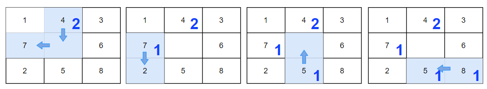
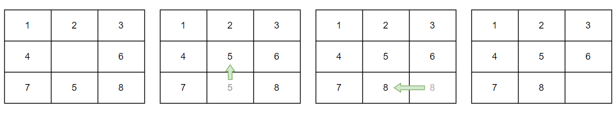
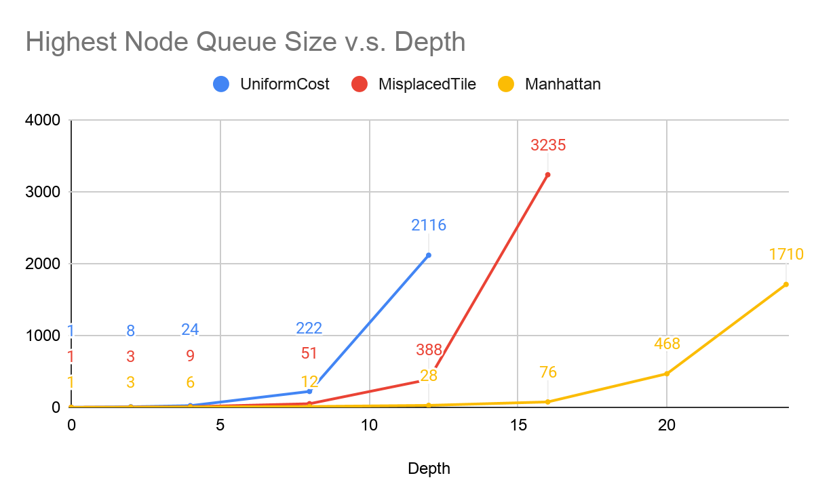
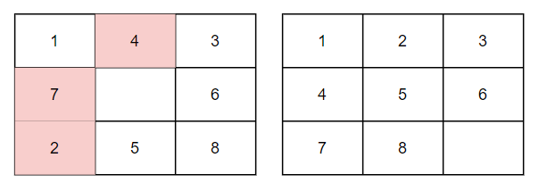
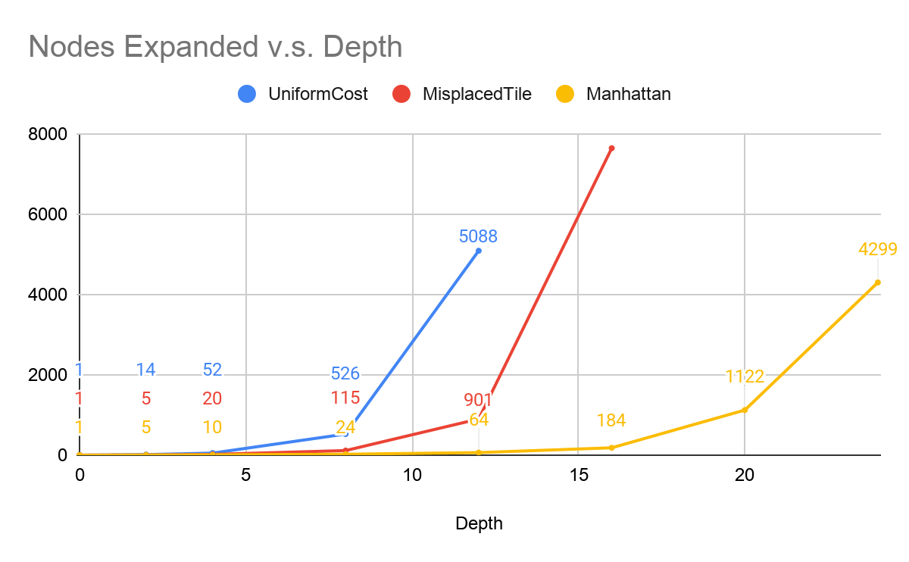
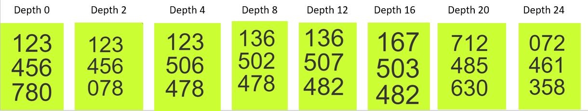

### **Introduction**

The eight puzzle is a combination puzzle where eight uniquely numbered tiles are uniquely positioned in a 3 x 3 board layout, leaving an empty tile space. These tiles can only be moved to an empty space. To solve the puzzle, the tiles must be positioned such that they are in ascending order from left to right then top to bottom, leaving the bottom right tile space empty.

Figure 1: A solution for a eight-puzzle problem

In this report, I will analyze three algorithms for solving this puzzle: 

**Uniform Cost Search**

According to Dr. Keogh, the uniform cost search algorithm is an “_A* [algorithm] with h(n) hardcoded to equal zero_” [^1]   that “_measures the cost to each node from the initial state_” [^2]. Because the algorithm’s heuristic is effectively useless, it will simply choose the cheapest expanded node.

**A* with the Misplaced Tile heuristic**

This algorithm’s heuristic considers the number of misplaced tiles (excluding the empty tile) for the heuristic h(n). So in Figure 2, the h(n) is 3.

Figure 2: A comparison between a state with misplaced tiles and the goal state

**A* with the Manhattan Distance heuristic**

This algorithm’s heuristic considers the total offset distance from the misplaced tile positions to their respective goal tile positions.  So in Figure 3, the h(n) is 2 + 1 + 1 + 1 = 5.

Figure 3: A solution to calculating the total distance of all misplaced tiles.

### **Performance Comparison Analysis**

All three algorithms were tested with the following set of test cases provided by Dr. Keogh.

Figure 4: Test cases identified by solution depth.

**Time Complexity Comparison Analysis**

The algorithm’s runtime is ultimately determined by the number of expanded nodes it has to check.

Figure 5: The number of nodes expanded versus the solution depth for all three algorithms. If an algorithm was unable to provide a solution within 10 minutes, its process was terminated. The nodes expanded for the misplaced tile algorithm is 7641.

For test cases with solution depths 0, 2, and 4, the differences in the total nodes expanded was relatively insignificant. However, the difference sharply grew in test cases with solution depths 8, 10, 12, and 16. The uniform cost algorithm fails to produce a timely result at test case with solution depth 16 and the misplaced tile algorithm fails to produce a timely result at test case with solution depth 20. Only the manhattan algorithm successfully passed all test cases. The manhattan algorithm had the least amount of nodes expanded with the misplaced tile algorithm following second and the uniform cost algorithm at last.

**Space Complexity Comparison Analysis**

The algorithm’s memory usage is ultimately determined by the number of nodes it has to store.

Figure 6: The highest node queue size expanded versus the solution depth for all three algorithms. If an algorithm was unable to provide a solution within 10 minutes, its process was terminated.

For test cases with solution depths 0, 2, and 4, the differences in the highest node queue size was relatively insignificant. However, the difference sharply grew in test cases with solution depths 8, 10, 12, and 16. The uniform cost algorithm fails to produce a timely result at test case with solution depth 16 and the misplaced tile algorithm fails to produce a timely result at test case with solution depth 20. Only the manhattan algorithm successfully passed all test cases. The manhattan algorithm had the least amount of total nodes allocated with the misplaced tile algorithm following second and the uniform cost algorithm at last.

**Conclusion**

*   In both time and space comparisons, the manhattan algorithm is first, the misplaced tile algorithm is second, and the uniform cost algorithm is third.
*   A possible reason for why the misplaced tile algorithm is faster than the uniform cost algorithm is that the misplaced tile algorithm has some heuristic while the uniform cost algorithm has effectively no heuristic.
*   A possible reason for why the manhattan algorithm is faster than the misplaced tile algorithm is that the misplaced tile algorithm provides a binary solution - it only takes into consideration whether the tile is in the correct spot or not (e.g. tile 7 is misplaced) and the manhattan algorithm provides a more quantifiable solution (e.g. tile 7 is misplaced by 3 tiles).

## Notes

[^1]:
     Project: 1 CS 170. Introduction to Artificial Intelligence Specifications

[^2]:
     CS170 Slides: Heuristic Search
